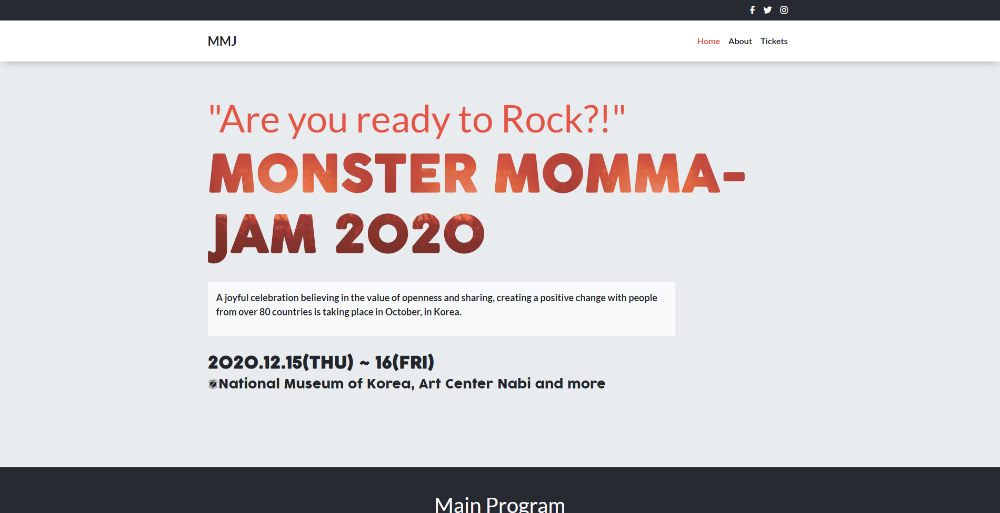

# Conference Capstone

An Original website using a pre-made design. Made with HTML, CSS and Bootstrap with various pages and responsive as well.

## Built With

- HTML
- CSS
- Bootstrap

## Live Demo

[Live Demo Link](https://janluc.github.io/CapstoneConference/index.html)

## Getting Started

To get a local copy up and running follow these simple example steps.

### Prerequisites

- A operating system such as Windows, MAC, or Linux
- A modern browser such as Google Chrome, Mozilla Firefox, or Microsoft Edge

### Setup
- Clone or download the repo and run the HTML File.

### Run tests
- StyleLint
- Webhint
- Lighthouse

## Authors

👤 **Author**

- GitHub: [@Janluc](https://github.com/Janluc)
- Twitter: [@Janluc123](https://twitter.com/Janluc123)
- LinkedIn: [LinkedIn](https://www.linkedin.com/in/janluc-saneaux-91707a1b4/)

## 🤝 Contributing

Contributions, issues, and feature requests are welcome!

Feel free to check the [issues page](https://github.com/alejandrotoledoweb/nyt-article/issues).

## Show your support

Give a ⭐️ if you like this project!

## 📝 License

N/A